<!-- Relative images "./img/" change to absolute "https://raw.githubusercontent.com/digitalinteraction/openmovement/master/Docs/omgui/img/" -->

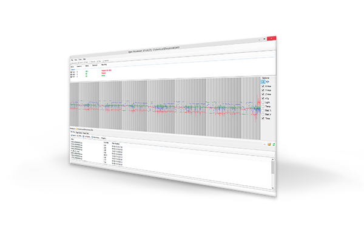

The AX3 OMGUI Configuration and Analysis Tool is a lightweight application designed to provide the following functionality:

+ Setup and configure AX3 sensors for recording
+ Download and visualize recorded data from AX3 devices
+ Provide an easy to use interface to convert binary AX3 recordings 
+ Provide access to validated analysis algorithms on recorded AX3 data

This document is intended as a guide to get to grips using the OMGUI software, learn about its features, and serve as a technical reference document.

---------------------------------------------------
#Downloading and Installing
The OMGUI software is available from the open source GitHub repository:

>  (Windows, zipped executable installer)

<!--
   * [Release page for AX3 OM GUI V28](https://github.com/digitalinteraction/openmovement/releases/tag/AX3-OmGui-v28)
   * [(Repos. copy) AX3 GUI](https://github.com/digitalinteraction/openmovement/releases/download/AX3-OmGui-v28/AX3-GUI-28.zip)
-->

The system requirements for the OMGUI software are a Windows PC with XP SP3 or later operating system and Microsoft .NET Framework v3.5 or later.  To install the software, open the downloaded archive and double-click the executable installer package.  

>**NOTE**: Administrator privileges will be required to install software.  The default location for installation is `C:\Program Files` but this can be changed to suit user- or system needs.

To connect with a sensor you will need to install the drivers as well as the software. These drivers come packaged with the OMGUI software and are configured to install as default during the installation process. 
The software has an inbuilt facility to update itself for major releases as well as updating the firmware on connected devices.

The OMGUI software uses `My Documents` as a default working folder location, you can choose any folder to work from.  If you need to share files with other users, consider using a shared or network drive location as the Working Folder.

---------------------------------------------------

#Quick Start
This section explains how to configure you device with the default settings and start collecting data. The default settings for configuration are:

+ 100Hz logging
+ Range ±8 g
+ Start logging on sensor disconnect

This section then proceeds to cover downloading data and exporting to a CSV file with timestamps. For more in-depth instructions and explanations, please read the relevant sections of this manual.

##Configure device

Connect the device and ensure it appears in the __Device Browser Pane__.

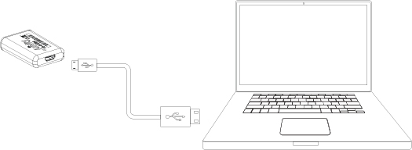

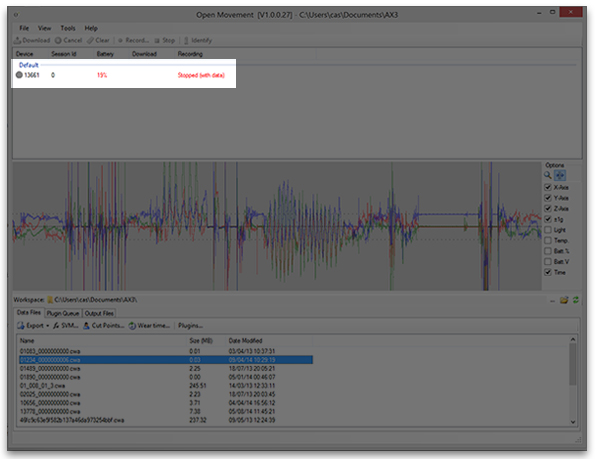

##Clear any existing data
To remove any existing data that may be stored on the device, ensure the device is highlighted in the __Device Browser Pane__ and left click the __Clear__ button in the __Device Toolbar__.

##Configure the sensor to record
The sensor may be set to record in a variety of ways (covered later in this manual). For default operation, the __Recording Window__ is configured as shown. 

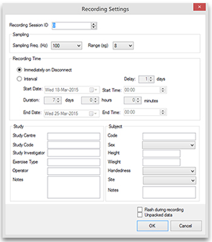

##Collecting Data
Once configured, click the __OK__ button to set the configuration. If you keep the default settings, at this stage the device browser pane will show that the device is set to "Always" record. The device can now be disconnected and it will start recording immediately.

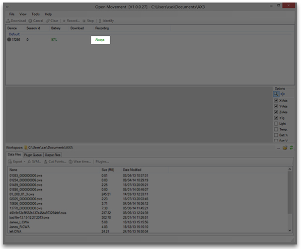

##Downloading the data
After the recording period the next step is to download the data from the device. To accomplish this, plug the device in to the USB port of the computer and wait for it to appear in the __Device Browser Pane__. If the device is still configured to record on disconnect, you will first have to click the __Stop__ button. Next, click the Download button in the __Device Toolbar__. The file then start to download to your working folder. Once downloaded the file will appear in the __Local Files Pane__. 

The data file is stored in an __.CWA__ binary format. This format is not compatible with Excel or other third party software. To get it in a more friendly format it must first be converted using the __Export__ function.

##Exporting to a comma separated value (.CSV) file
In order to use the raw data with a third-party software package, such as Excel, it must first be converted into a suitable format. This can be done using the __Export Window__. To instigate this, select the file in the __Files Tab__ within the Local Files Pane and click __Export__ button.

The following window will appear. Set the configuration as shown below and click the OK button to generate the file.

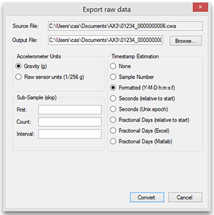

##Using Exported data
Files generated in using the __Export__ function will appear in the __Working Folder__. To open the __Working Folder__, click the button shown below at the side of the __Local Files Pane__.

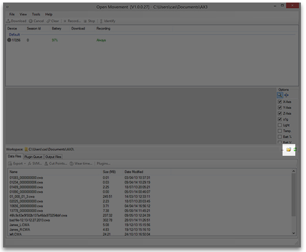

It is important to note that files exported to CSV format can become very large. Typically software such as Excel can only handle a few hours of data before it struggles. For multi-day recordings, the user should consider working directly with the binary files if developing algorithms, or if the user is happy with one of the existing inbuilt algorithms in the software, using summary measures. These will be covered later in this document.

---------------------------------------------------

#Software Features

##Interface orientation

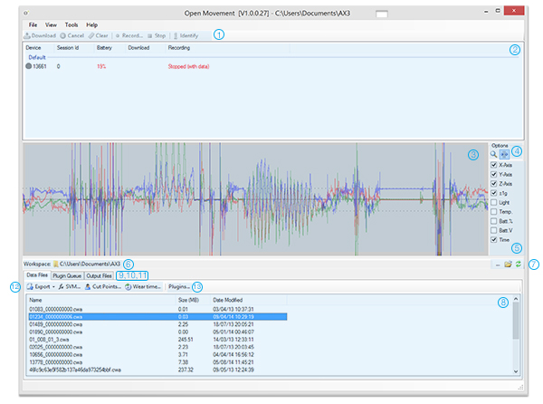

1. __Device Toolbar__
2. __Device Browser Pane__
3. __Data Preview Window__
4. __Selection Tools__
5. __Preview Filters__
6. __Working Folder__
7. __Working Folder Options__
8. __Local File Browser Pane__
9. __Data Files Tab__
10. __Plugin Tab__
11. __Output Tab__
12. __Analysis Toolbar__
13. __Plugins Button__

For devices that have data stored on them, the __Data Preview Window__ gives an overview of the recording and the __Preview Filters__ on the right may be used to toggle data streams on or off.

The OMGUI software was programmed with the following functions in mind:

+ Configuring sensors for recording
+ Previewing and downloading data
+ Analysis and data manipulation

The above topics will now be discussed in detail.

##Configuring sensors for recording
The OMGUI software displays all connected devices and their states in the __Device Browser Pane__. This information can be used for checking a devices current configuration as well as making sure the battery level is sufficient to complete the recording required. 

>**NOTE**: Best practice not to issue a device with less than 85% battery level.

With a device in the __Device Browser Pane__ selected, the buttons on the __Device Toolbar__ can be used to perform the following operations:

+ **Download.** If the connected device has any data recordings, this button downloads the recordings to the __Working Folder__.

+ **Cancel.** If the connected device is being downloaded, this button terminates the operation.

+ **Clear.** If the connected device has and data recordings, this button clears them. This operation is irreversible.

+ **Stop.** If the device is currently set to record, this button will clear the configuration so that when the device is disconnected it will enter into __Standby__ mode.

+ **Identify.** This button will flash the LED on any selected device. It is designed to assist device identification when multiple devices are connected at once.

+ **Record.** This button is used to configure the device to record. The button brings up the __Recording Window__:

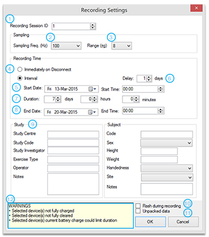

1. **Recording Session ID.** This field provides utility to mark the recording with a unique ID. This is useful in studies where patient data needs to be anonymized as the ID can be linked to a patient record.

2. **Sampling Frequency.** This is the number of times per second the sensor data will be recorded. For more information on choosing a sample frequency please see the sensor user manual. The default value is 100Hz which is adequate for most human movement studies.

3. **Sampling Range.** This is the maximum value that the sensor will record. For more information on choosing a range please see the sensor manual. The default setting is suitable for most human movement studies.

4. **Immediately on Disconnect.** In this configuration the sensor will start recording as soon as it is unplugged from the computer.

5. **Interval Start Date/Time.** If the interval option is selected, the user can select a specific date and time to start recording on.

6. **Interval Delay.** In interval mode, the user can specify a number of days before the sensor will start recording with the present day as an index. For example “start recording in 2 days time”. The user is also able to directly select a date, and fine tune the start time using the Start Date/Time options.

7. **Interval Duration.** In interval mode, the user can specify a duration to record for. If the duration exceeds the physical capabilities of the device, a warning will be given.

8. **Interval Stop Date/Time.** In interval mode, the user can specify a specific date and time to stop recording on. If the duration exceeds the physical capabilities of the device, a warning will be given.

9. **Study and Subject Meta Data.** The device is able to store meta data along with the recorded data. This section provides the user provision to add a series of descriptive fields that will persist alongside the data recording; thus alleviating the possibility of metadata misalignment at a later date. All fields are optional in this section.

10. **Flash during recording.** If checked, this box will put the device in a mode whereby a small flash is periodically given when a device is actually recording (if an interval is set, the device will remain silent during the standby phase). Default is to have the device silently record to avoid wearer disruption.

11. **Unpacked data.** If checked, this option will configure the device to adopt a 6-bytes per sample format. Left unchecked (default) the device will adopt a 4 bytes per sample "packed" format, which enables it achieve a logging performance of 14 days at 100Hz with sufficient resolution for human movement studies. 

12. **Notes Area.** This section is used for warnings to the user about any potential issues with the chosen configuration.

##Previewing and downloading data
Any connected devices will appear in the __Device Browser Pane__ marked as having data. When highlighted, data on these devices can be previewed in the __Data Preview Window__. There is a __Zoom__ tool and __Highlight__ tool in the __Selection Tools__ section. In the __Preview Filters__ section, a number of checkboxes exist to help the user visualize the data. On mousing over the data, the user is able to get a precise data preview at any given instant in the recording.

Recorded data stored on the sensor can be downloaded to the __Working Folder__ by clicking the __Download__ button. Download time is approximately 6 minutes for 7 days worth of data.

To open and view the contents of the __Working Folder__ or change working folders, buttons are available in the __Working Folder Options__ part of the interface.

##Analysis and data manipulation
Downloaded data will appear in the __Data Files Browser Pane__. This section of the interface displays all data files currently stored in the __Working Folder__. When a file is highlighted, a preview of the data is shown in the __Data Preview Window__. The OMGUI provides several ways for working with data:

+ Export Function for working with data in an external analysis package
+ Integrated algorithms (via __Analysis Toolbar__) for working with data via pre-validated algorithms
+ __Plugins__ for working with data via an externally developed analysis package within the OMGUI environment

###Export Function
Captured recordings are stored in a binary format that is not always directly compatible with external program environments. For this reason a built-in export facility is provided to enable captured recordings to be transcribed into various formats. 

###Export Re-sampled WAV 
This option can be used to transcribe the binary format file into an audio WAVE file (WAV). In this format the data streams are interpolated over the recording duration. This is done via a bi-cubic spline algorithm. 
The WAV converter re-samples the binary data file produced on-board the
accelerometer to produces a 4-channel, 16-bit standard WAVE file.  The
first three channels correspond to the X-, Y- and Z-axes from the
accelerometer (and a normalized -1 to 1 value must be scaled by the
range setting, which can be obtained from the WAV header, with a
default of 8 for +/- 8g). The fourth channel contains other
information from the logging device, such as temperature, light and
battery measurements -- encoded into the 16-bit values.

###Export Re-sampled CSV
This operation can be used to convert a binary file into a CSV file format with a fixed sample period; useful for analysis that cannot handle variable sample rates. A bi-cubic interpolation is used to determine timestamps.

>**NOTE**: CSV files of samples are considerably larger than binary counterparts and thus consideration to memory requirements must be given when using them.  Binary WAV files should be preferred where it is possible to use them. 

###Export Raw CSV
The __Export Raw__ function allows a destination to be chosen, and has a separate window where a variety of export options can be chosen:

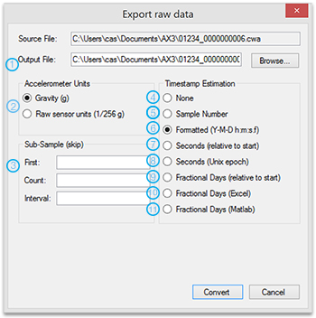

The following options are available on the __Export Raw Window__

1. **Output File Path**. This is the location where the output file will be placed. The user must have write permission to this location.

2. **Accelerometer Units**. The exporter provides utility to provide either the accelerometer readings as raw sensor values, or in units of 'g' (1g = 9.81 m/s2).

3. **Sub-Sample**. Using the __Selector Tool__ in the __Data Preview Window__, a specified data slice can be passed to the export window. The start and end of this slice can be verified in this section of the window.

4. **No Timestamp Information**. Column 1, 2 and 3 of the CSV file will be X, Y, Z accelerometer axis respectively.

5. **Sample Number** will generate an incrementing number in column 1. Column 2, 3 and 4 will be X, Y, Z accelerometer axis respectively.

6. **Formatted** will generate a timestamps formatted in ISO 8061 format (`YYYY-MM-DD hh:mm:ss.fff`) in column 1. Column 2, 3 and 4 will be X, Y, Z accelerometer axis respectively.

7. **Seconds (relative to start)** will generate timestamps in seconds relative to the first sample in Column 1. Column 2, 3 and 4 will be X, Y, Z accelerometer axis respectively.

8. **Seconds (Unix epoch)** will generate time in Unix format (POSIX time); seconds since epoch of 1st January 1970. Column 2, 3 and 4 will be X, Y, Z accelerometer axis respectively.

9. **Fractional Days (relative to start)** will generate time in fractions of days relative to the first sample. Column 2, 3 and 4 will be X, Y, Z accelerometer axis respectively.

10. **Fractional Days (Excel)** will generate time in fractions of days since the Microsoft Excel epoch (1st Jan 1900). Column 2, 3 and 4 will be X, Y, Z accelerometer axis respectively.

11. **Fractional Days (Matlab)** will generate time in fractions of days since the Unix epoch (1st Jan 1970). This is the time format Matlab and R use. Column 2, 3 and 4 will be X, Y, Z accelerometer axis respectively.

##Analysis Toolbar
The __Analysis Toolbar__ provides the user fast provision to work with a selection of validated algorithms within the OMGUI environment. 

##Standard Vector Magnitude (SVM)
The Standard Vector Magnitude (SVM) has been shown to be a useful measure for working with when axis specific information is not required. The SVM can be calculated in conjunction with, or without, a bandpass filter. Options for using the SVM calculation are now explained:

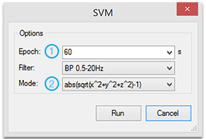

1. **Epoch.** This is the length of time each SVM averaging is made over. Default is 60 seconds. If number of samples in the file does not fit into an exact integer of epochs, the last epoch will be partial.

2. **Mode.** The SVM calculation can be made in a mode where all negative values of the SVM are rectified: abs(sqrt(x^2 + y^2 + z ^2)-1), or discarded: max(0,sqrt(x^2 + y^2 + z ^2)-1)

The output of the SVM tool is a CSV file stored in the working folder.

In detail: Scalar Vector Magnitude takes the accelerometer vector length
from the euclidean distance of the three accelerometer axes, and
subtracts the 1 g expected from gravity while stationary:

    SVM-1 = sqrt(x^2 + y^2 + z^2) - 1

This signal can (optionally) be improved by filtering for only
frequencies of human movement, by applying a fourth-order Butterworth
band-pass filter between 0.5Hz and 20Hz. Negative values are dealt
with by either taking the 'absolute' value (default), or clipping them
to zero. This value is aggregated into a mean measurement over
user-defined epoch length (in seconds). The resulting means are then,
either:

    sum(abs(sqrt(x^2 + y^2 + z^2) - 1))
    sum(max(0, sqrt(x^2 + y^2 + z^2) - 1))

For more details on the SVM algorithm please see [1].

##Cut-points
When using the accelerometers to measure physical activity, time spent in specific states has been demonstrated to be a useful output. The __Cut-point__ analysis reports the time user has spent in a specific intensity of physical activity where each intensity band is categorized in units of Metabolic Equivalent of Task (METS).

|Activity Level | MET  Threshold |
|:--------------|:--------------:|
| Sedentry      | < 1.5          |
| Light         |1.5 < and < 3.99|
| Moderate      |4.0 < and < 6.99|
| Vigorous      |7.0 <

> 1 MET = 3.5 ml O2 . kg^-1 . min ^-1 which is the equivalent of 58.2 W/m^2 or the rate of energy produced per unit surface area of an average person seated at rest.

To provide utility of converting accelerometry data into METS for specific population groups and for specific mounting sites of the sensor, the following interface is provided:

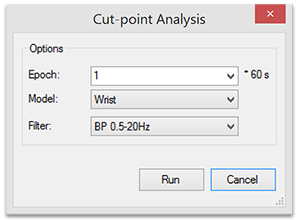

This algorithm is based on that proposed in [2], which takes an abs(SVM-1) values at 80Hz summed over 60 seconds.  Our implementation compares the mean SVM over 60 seconds against 'cut points' which divide the results into time spent in activity levels: sedentary (< 1.5 METS), light (>= 1.5 METS, < 4
METS), moderate (>= 4 METS, < 7 METS), and vigorous (>=7 METS). The results are summed over user-defined multiples of the 1-minute epoch.

##Wear Time Validation (WTV)
The wear time validation (WTV) algorithm is designed to give a high level view if the device has been worn or not. It is unspecific to mounting site and based on the accelerometer readings. A screen-shot of the interface is give below.

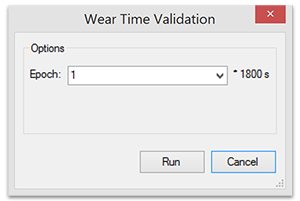

The algorithm is based on the method proposed in [2], where accelerometer non-wear time is estimated from the standard deviation and range of each accelerometer axis calculated over 30-minute periods. Each period is classified as non-wear time if the standard deviation was less than
3.0 mg for at least two out of the three axes, or if the value range,
for at least two out of three axes, was less than 50 mg.  The results
are summed for user-defined multiples of 30 minute intervals.

The units reported in the WTV are the sum of the number of 30min windows detected within the epoch period. For example, if the epoch period is 1 hour and the sensor is worn continuously, the result will be 2. If the sensor is worn for the first 30 mins and then removed, the result will be 1. In the WTV process, windows are non-overlapping and treated as discrete chunks.

##Plug-ins for OMGUI
Plug-ins provide a way for developers to develop their own algorithms in their choice of environment and link them into the OMGUI interface. If you are interested in developing plug-ins or for more please consult the Open Movement source code pages at [www.openmovement.co.uk](www.openmovement.co.uk).

[1]:http://www.ncbi.nlm.nih.gov/pubmed/21088628
[2]:http://journals.plos.org/plosone/article?id=10.1371/journal.pone.0022922
[3]:http://ieeexplore.ieee.org/xpl/articleDetails.jsp?arnumber=5534986
