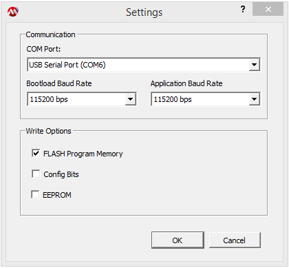
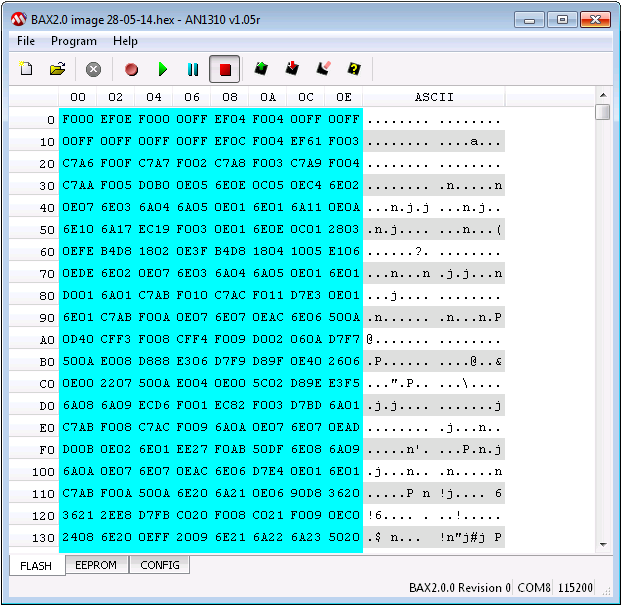

# Device Firmware

Firmware updates for BuildAX devices will be provided as a .hex file. This 
document describes the process of flashing the devices with updated firmware.

 
**Warning:** Updating the firmware is a potentially risky process. If you 
 flash a device with an incorrect firmware file (or use a third-party
 bootloader application which has a bug) you could render it permanently unusable!

## Downloads
Tested bootloader software for the BAX devices is provided for Windows OSes
in the OpenMovement repository, along with the firmware for each device. 

[Download BuildAX Firmware here](http://openmovement.googlecode.com/svn/downloads/BuildAX/). 
Ensure you download the correct firmware for your device.

## BuildAX LRS

 
**Web Interface Upgrades:**
The web interface data files do not also need to be upgraded when a firmware
upgrade is applied, but this is recommended in order to access new and
improved functionality. See [here](quickstart.md#lrs-setup) for more information.

### Put the LRS into bootloader mode

Remove the USB power connector from the LRS. Hold down the button on the 
rear of the device and connect the USB cable between the PC and the LRS. 
The LRS should enter bootloader mode, indicated by the LEDs counting up 
from 1-7 continuously. 

### Connecting to the PC 

Open the firmware flashing tool provided in the OpenMovement repository. 
Tools for other platforms may be available online.

Enable the USB checkbox. The Vendor ID should be `0x4D8`, and the Product ID  
`0x03C`. Now hit the "Connect" button. The tool should show that it has 
connected to the device.

 

Next, click "Load Hex File" and select the new firmware. **Double check** that
you have selected the correct firmware file for the LRS. Then, click
"Erase-Program-Verify", and the new firmware will be written to the device.

When this is completed, "Run Application" will cause the LRS to exit
bootloader mode. If using a USB wall power adaptor, it is now safe to remove 
the device from the PC and re-connect it to its own adapter.

#### Reset ALL Settings (re-generate MAC address)

To permanently reset all settings, including assigning a new random MAC address,
hold the button on the rear of the LRS and click "Run Application" at this
stage. Note that this may result in the LRS not being able to access the
network if you have used the device's old MAC address to assign it an IP.

### Video

<iframe width="560" height="315" src="//www.youtube.com/embed/pa5SAfqBDH0" frameborder="0" allowfullscreen></iframe>

---
## BuildAX ENV Sensor

Writing a firmware `.hex` file onto a BuildAX ENV sensor requires a PIC18f 
bootloader application. A Windows executable will be provided in the 
OpenMovement repository for this purpose (AN1310ui.exe).

 
**FTDI cable:** To connect to a BuildAX sensor, a suitable FTDI cable is 
    required. Please refer to the [Connection Guide](connecting.md) for details 
    of the cable and driver installation.

### Put the ENV into bootloader mode

 1. Insert batteries into the ENV sensor
 2. Push the FTDI cable onto the 3-pin header on the device, with the orange
    wire facing the corner of the device (the USB end should be connected to 
    your PC).
 3. Push the button next to the programming header while the green LED on the 
    sensor is lit.

The LED will flash red/green briefly before lighting solid red. This indicates
that the sensor is now in bootloader mode.

### Writing new firmware

Now you should connect the PC bootloader application to the sensor. You will 
need to set the correct serial port and baud rate in the settings dialog 
(program -> settings).

 

In the AN1310 PIC18f bootloader, click the red "stop" button in the toolbar. 
Then, load the new firmware into the application using the "open" menu. The 
application should now look similar to this: 

 

Hit the "Write Device" button on the toolbar (rectangle with red arrow) to 
program the device with the new firmware. When completed, the status bar 
should show "Write complete (Flash 11.897s)" or similar time. Finally, hit the
"Run Application Firmware" button (the green "play" arrow) to exit bootloader 
mode.

### Video

<iframe width="560" height="315" src="//www.youtube.com/embed/jz1PkleHc5E" frameborder="0" allowfullscreen></iframe>

